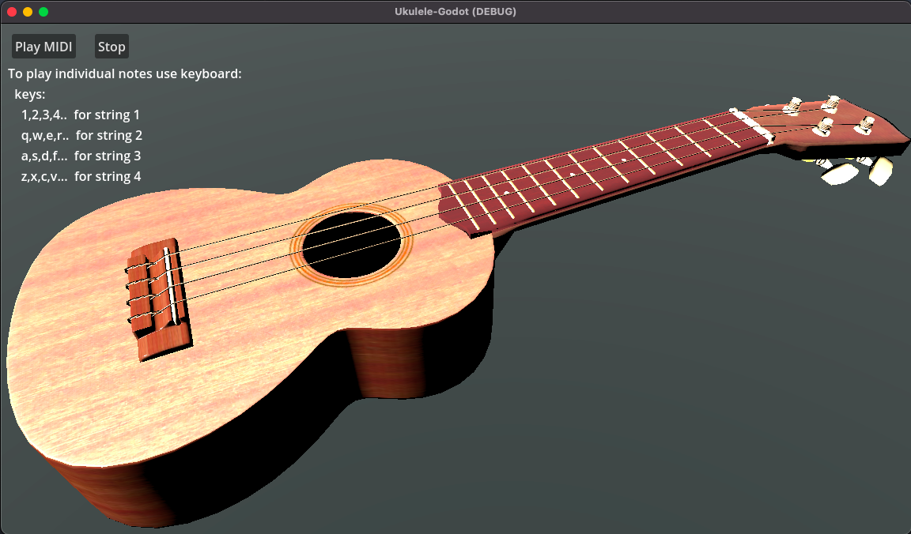

# Ukulele 3D Project
Educational web tools to learn playing Ukulele

# Details
- Godot 4.1.2
- Blender 3.6.2

# Credits
- Original Ukulele 3D model:
Carlos Capanga
https://www.blendswap.com/blend/17661
License: CC-BY

- MIDI file parser:
Yui Kinomoto
https://bitbucket.org/arlez80/godot-midi-player

